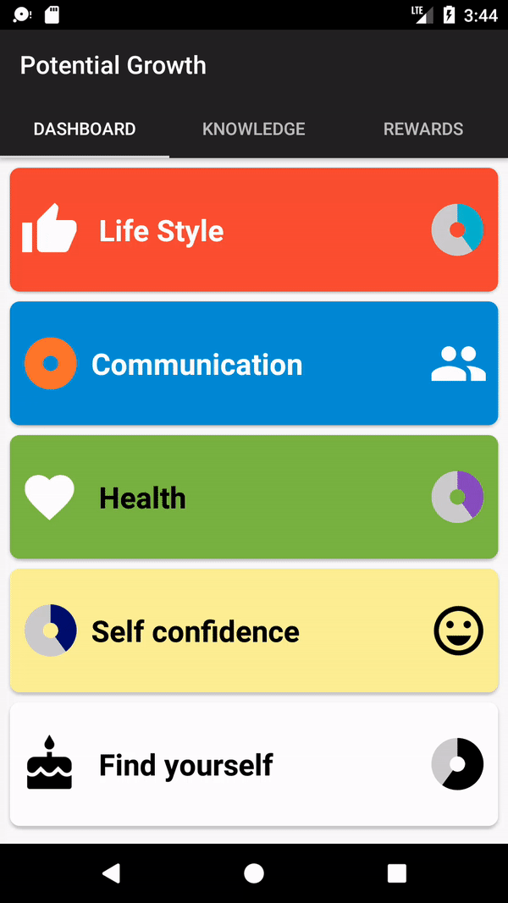
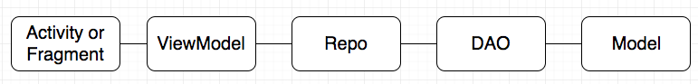

# develop-our-potential
Work in progress, Android app project with the purpose to teach communication skills, conflict management, human science from developer perspective.

The tab 1 shows your weekly goals : 

The tab 2 displays topics to learn : 

The tab 3 displays rewards : 

The detail tab 2 give you the possibility to check if you as done the topic today and to comment the topic : 

We use transition between list and detail :

Files are organized as shown in the following diagram :

Activities or fragments should include only code related to data binding.

ViewModels contain the object to be displayed on the screen.

Repo are responsible for asking the right data source and organizing data for the ViewModel.

DAO classes are using Room to make SQL requests.

Model classes are entities use by Room to create table and logic objects to be displayed.