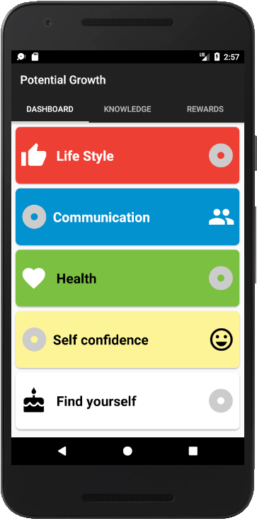
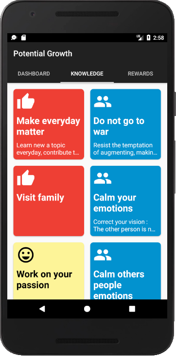
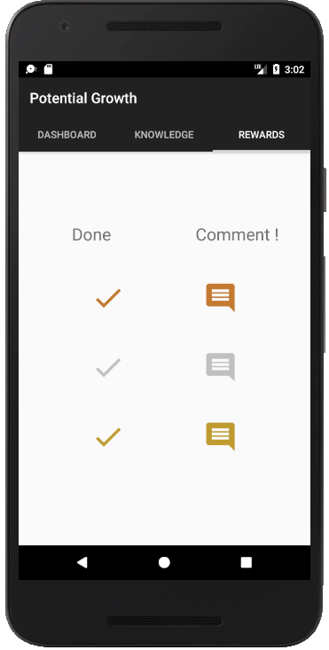
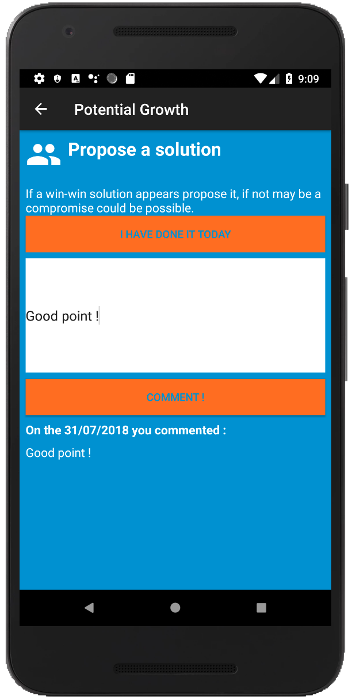

# develop-our-potential
Work in progress, Android app projet with the purpose to teach communication skills, conflict management, humain science from developer perspective.

The tab 1 shows your weekly goals : 

The tab 2 displays topics to learn : 

The tab 3 displays rewards : 

The detail tab 2 give you the possibility to check if you as done the topic today and to comment the topic : 

We use transition between list and detail :

